# TryHackMe — SQL Fundamentals

> **Track:** Cyber Security 101 → Web Hacking
> **Difficulty:** Easy · **Time:** ~120 min
> **Focus:** Relational database concepts, DBMS/SQL basics, and hands-on querying with `mysql`


SQL is the language behind almost every web application's backend — and almost every SQL injection vulnerability. Before attacking a database, you need to be fluent in querying one properly. This room builds that fluency from database theory through to real `mysql` CLI queries against a sample dataset.

---

## Table of Contents
1. [Database Concepts: Types, Tables, and Keys](#1-database-concepts-types-tables-and-keys)
2. [DBMS and SQL](#2-dbms-and-sql)
3. [Listing Databases and Capturing the First Flag](#3-listing-databases-and-capturing-the-first-flag)
4. [Switching Databases and Listing Tables](#4-switching-databases-and-listing-tables)
5. [Querying the `tools_db` Dataset](#5-querying-the-tools_db-dataset)
6. [Aggregation and String Functions](#6-aggregation-and-string-functions)
7. [Key Takeaways](#7-key-takeaways)

---

## 1. Database Concepts: Types, Tables, and Keys

The room opens with the theory needed to reason about *any* database, before touching a keyboard:

- **Non-relational database**: the right choice when the data being stored will vary greatly in format (documents, key-value pairs, etc.).
- **Relational database**: the right choice when data reliably follows the same structured format — rows and columns.
- **Row**: once a record (e.g. a book) is inserted into a table, it exists as a **row** in that table.
- **Foreign key**: provides a link from one table to another, enforcing relationships between datasets.
- **Primary key**: ensures a record is unique within its own table.

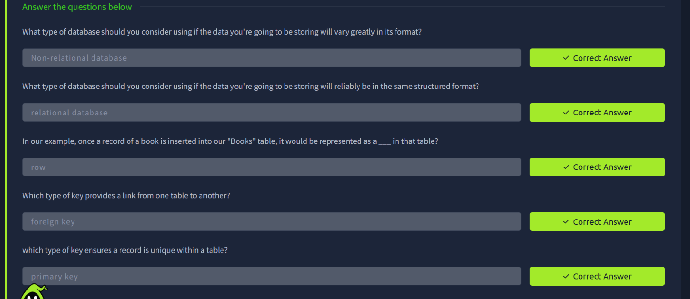

---

## 2. DBMS and SQL

- A **DBMS (Database Management System)** serves as the interface between a database and an end user — it's the software layer (MySQL, PostgreSQL, MSSQL, etc.) that actually handles storage, retrieval, and permissions.
- **SQL (Structured Query Language)** is the query language used to interact with a relational database through that DBMS.

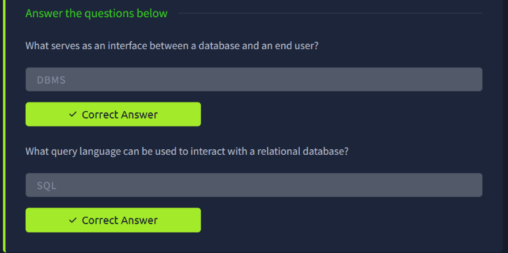

---

## 3. Listing Databases and Capturing the First Flag

With theory covered, the room moves into the `mysql` CLI. The first practical task is listing every database the current user can see:

```sql
SHOW DATABASES;
```

Scrolling the output reveals a database whose *name itself* is the flag for this task, sitting alongside the standard system schemas (`information_schema`, `mysql`, `performance_schema`, `sys`) and the task-specific ones (`task_4_db`, `thm_bookmarket_db`, `thm_books`, `thm_books2`, `tools_db`).

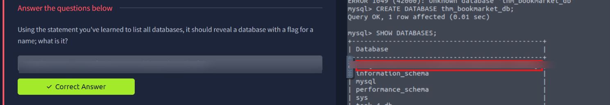

> Flag redacted — the technique (`SHOW DATABASES;` and reading the result set) is what matters.

---

## 4. Switching Databases and Listing Tables

Next, the room asks you to make `task_4_db` your active database and enumerate its tables:

```sql
USE task_4_db;
SHOW TABLES;
```

The single table name returned in `task_4_db` is itself the second flag.

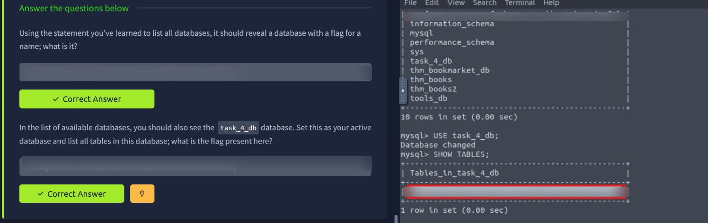

> Flag redacted.

---

## 5. Querying the `tools_db` Dataset

The rest of the room works against a realistic dataset: `tools_db.hacking_tools`, a table of penetration-testing hardware with `name`, `category`, and `amount` (price) columns.

### Full table dump

```sql
USE tools_db;
SELECT * FROM hacking_tools;
```

This lays out all 8 tools across 6 categories — multi-tool, cable-based attacks, Wi-Fi hacking, USB attacks, RFID cloning, and network intelligence. Two entries stand out for the exercise: **Wi-Fi Pineapple** (Wi-Fi hacking, used for man-in-the-middle attacks on wireless networks) and the shared **USB attacks** category covering both **USB Rubber Ducky** and **Bash Bunny**.

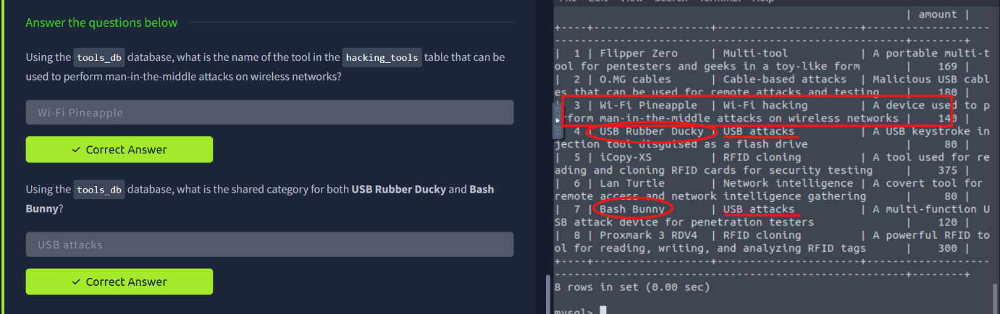

### Counting distinct categories

```sql
SELECT DISTINCT category FROM hacking_tools;
```

Returns 6 distinct categories: Multi-tool, Cable-based attacks, Wi-Fi hacking, USB attacks, RFID cloning, Network intelligence.

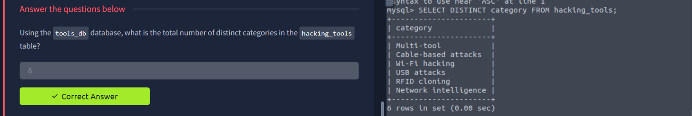

### Sorting with ORDER BY

```sql
SELECT name FROM hacking_tools ORDER BY name ASC;
SELECT name FROM hacking_tools ORDER BY name DESC;
```

Ascending order puts **Bash Bunny** first; descending order puts **Wi-Fi Pineapple** first.

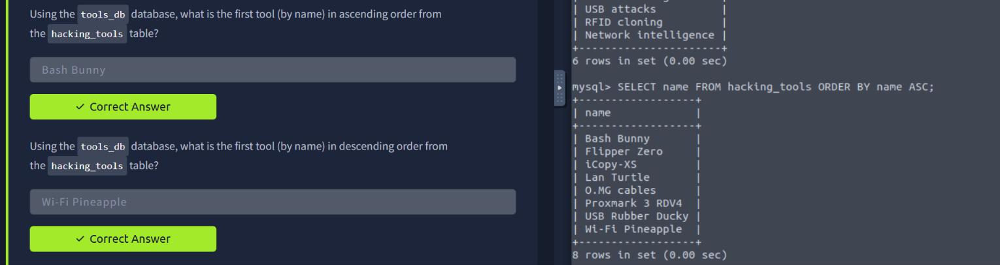

### Filtering with WHERE

```sql
SELECT name FROM hacking_tools WHERE category = 'Multi-tool';
```
→ **Flipper Zero**

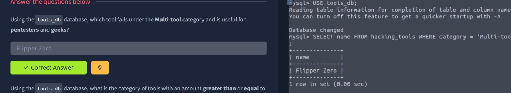

```sql
SELECT category FROM hacking_tools WHERE amount >= 300;
```
→ **RFID cloning** (returned twice, once per matching tool)

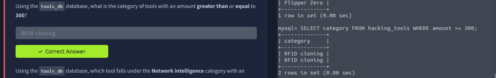

```sql
SELECT name FROM hacking_tools WHERE category = 'Network intelligence' AND amount < 100;
```
→ **Lan Turtle**

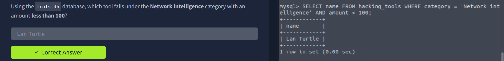

---

## 6. Aggregation and String Functions

### Longest name with `LENGTH()`

```sql
SELECT name FROM hacking_tools ORDER BY LENGTH(name) DESC LIMIT 1;
```
→ **USB Rubber Ducky** — the longest tool name by character count.

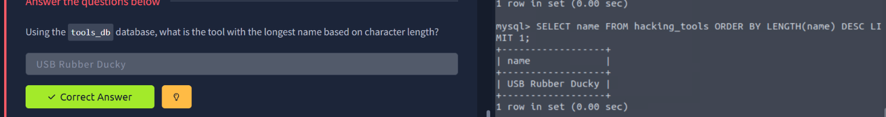

### Summing a column with `SUM()`

```sql
SELECT SUM(amount) FROM hacking_tools;
```
→ **1444** — the combined price of every tool in the table.

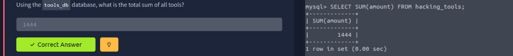

### Conditional filtering + string aggregation with `GROUP_CONCAT()`

```sql
SELECT GROUP_CONCAT(name SEPARATOR ' & ') 
FROM hacking_tools 
WHERE amount % 10 <> 0;
```

The `amount % 10 <> 0` condition filters for prices that don't end in a zero, and `GROUP_CONCAT` merges the matching names into a single string joined by `" & "`.

→ **Flipper Zero & iCopy-XS**

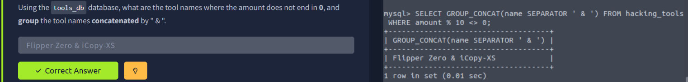

---

## 7. Key Takeaways

- **Relational vs non-relational** is a modeling decision driven by how consistent your data's structure is.
- **Primary keys** enforce uniqueness within a table; **foreign keys** are what stitch separate tables into a relational structure.
- The core query toolkit covered here — `SHOW`, `USE`, `SELECT ... WHERE`, `ORDER BY`, `DISTINCT`, and aggregate functions (`SUM`, `LENGTH`, `GROUP_CONCAT`) — is exactly the toolkit you reach for first when manually exploring a database after gaining SQL access, whether that's a legitimate admin session or the result of a successful SQL injection.
- Reading query output carefully matters: both flags in this room were hidden in plain result sets (a database name and a table name), not in any special output.

---

*Room completed on 27 September 2026 as part of the Cyber Security 101 path.*
